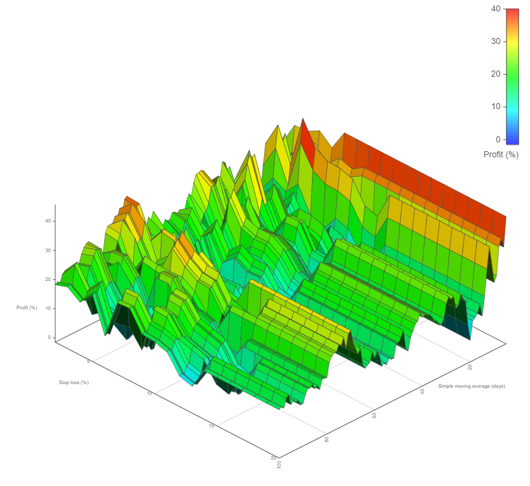

# Graph3d-example

An example of rendering a 3D graph with [Graph3d](https://github.com/visjs/vis-graph3d).

I'll be adding support for this in the future to [Data-Forge Notebook](https://www.data-forge-notebook.com/)!

If you like this project, please star this repo and [support my work](https://www.codecapers.com.au/about#support-my-work)

## Screenshot

This is what the 3D graph looks like:



## The data 

The data being visualized in this example is a byproduct of optimizing a mean reversion stock trading strategy.

The graph shows the profit (%) of the strategy (the z axis) vs the parameters of the strategy. The parameters are SMA period (days) (the x axis) and stop loss (%) (the y axis).

## Setup

You need Node.js installed to run this example.

Download [a zip file of the code](https://github.com/ashleydavis/graph3d-example/archive/master.zip) or use Git to clone this respository.

Then open a terminal, change to the directory and install dependencies:

```bash
cd graph3d-example
npm install
```


## Run it

Now use live-server to run a web server:

```bash
npm start
```

To see the 3D graph, open your web browser and navigate to: http://localhost:8080

## Other examples

See here for a list of other examples:

- (https://visjs.github.io/vis-graph3d/examples/graph3d/)[https://visjs.github.io/vis-graph3d/examples/graph3d/]
